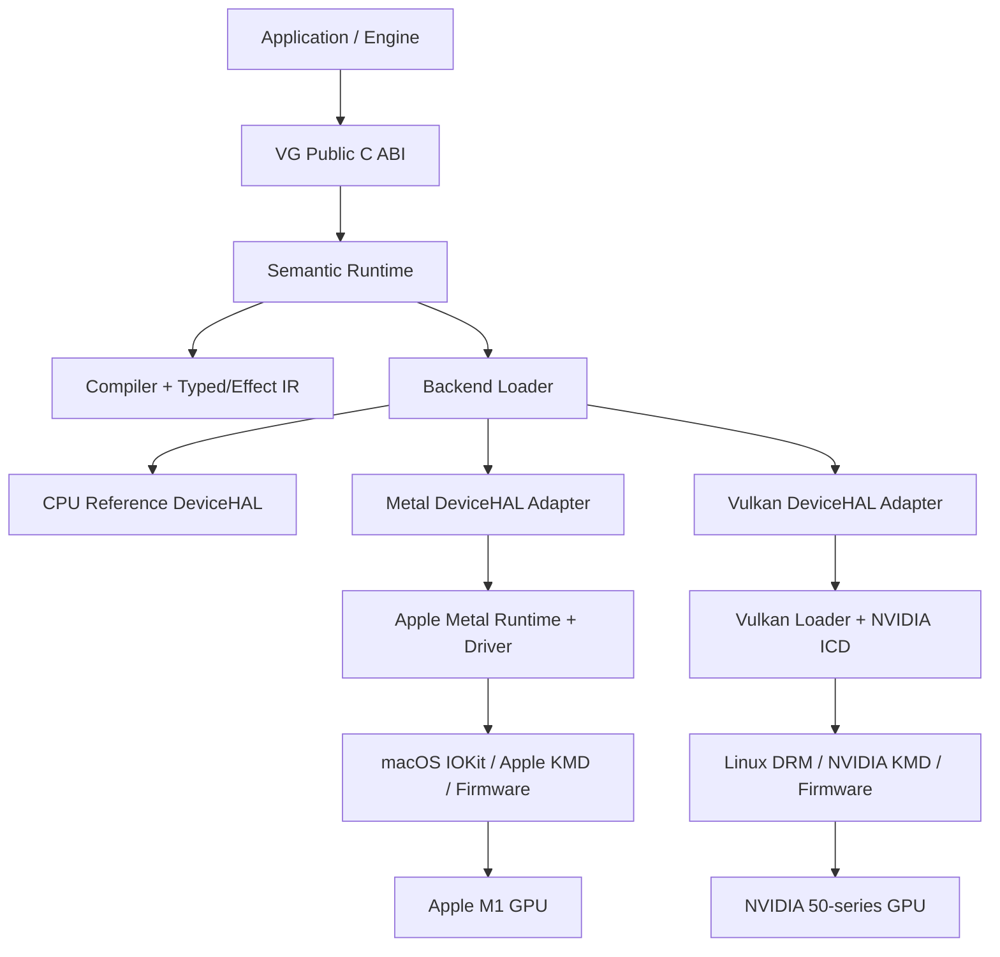
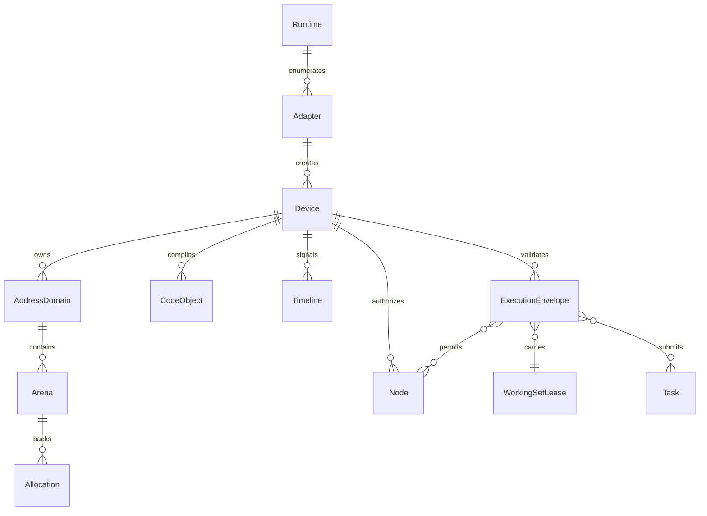
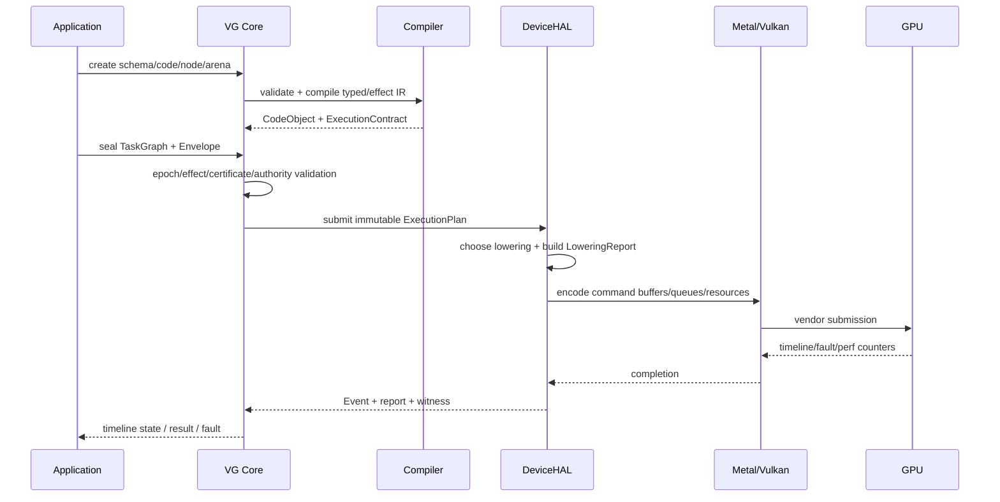

# 03 System Architecture

本文件规定 VG 原型的组件边界、对象关系、调用路径与后端隔离。它回答“一个包含 VG 头文件的程序，最终怎样在 M1/Metal 或 NVIDIA/Vulkan 上执行”。语义细节以 [02-principles-and-semantics.md](02-principles-and-semantics.md) 为准。

## 1. 四层依赖不是四层包装



四个逻辑层为：

1. **Public C ABI**：稳定、跨语言的入口；只表达 VG 对象与语义，不暴露 C++ STL 或 backend handle。
2. **Semantic Runtime**：验证生命周期、effect、证书、epoch、授权和 submission；构造不可变执行计划。
3. **DeviceHAL**：把已经验证的计划 lowering 到一个设备后端，并报告实现类别和隐藏成本。
4. **PlatformHAL/厂商栈**：窗口、显示、进程、动态库、OS timeline 以及 Metal/Vulkan 驱动入口。

它们不是简单的一对一 wrapper。Core 可以在一次提交前进行证明、合并和拒绝；DeviceHAL 可以缓存或生成 backend 对象；PlatformHAL 处理 OS authority。未来原生 VG UMD 可以替换 Metal/Vulkan adapter，但不改变公共语义。

## 2. 与 Vulkan 层级的准确对应

```text
Vulkan application
  -> Vulkan public C ABI
  -> Vulkan loader
  -> vendor ICD/UMD
  -> vendor KMD
  -> firmware/GPU

VG application
  -> VG public C ABI
  -> VG semantic runtime + backend loader
  -> VG Metal/Vulkan DeviceHAL adapter       [当前实现]
  -> Metal runtime or Vulkan loader/ICD
  -> vendor KMD
  -> firmware/GPU

VG application
  -> VG public C ABI
  -> VG semantic runtime + backend loader
  -> native VG DeviceHAL/UMD                  [未来合同]
  -> compatible vendor/open KMD
  -> firmware/GPU
```

Vulkan loader 本身只解决 ICD 发现、分派和扩展协商，不等同于 VG 的 Semantic Runtime。VG DeviceHAL 在当前硬件上可以并且应该复用厂商 KMD，但必须通过 Metal 或 Vulkan 厂商 UMD 间接使用。原因不是架构禁止，而是各厂商 KMD UAPI、命令包、shader ISA、cache/tiling/compression metadata 和 firmware 协议并不统一，也不保证公开稳定。

## 3. 核心组件

| 组件 | 必须负责 | 明确不负责 |
|---|---|---|
| `vg_api` | C ABI 参数检查、handle dispatch、错误返回 | backend 策略猜测 |
| `vg_core` | 对象状态、epoch、effect、certificate、submission validation | 调用 Metal/Vulkan 细节 |
| `vg_ir` | schema、typed/effect IR、contract inference、serialization | OS allocation |
| `vg_compiler` | source/IR validation、specialization、backend package | submission scheduling |
| `vg_backend_loader` | plugin 发现、ABI 协商、adapter 枚举 | 合并 backend capability |
| `vg_device_hal` | allocation/lowering/submit/timeline/fault/report | 改写 VG 语义 |
| `vg_platform` | dylib、thread、clock、window/surface、file/cache | GPU program semantics |
| `vg_capture` | canonical capture、stable IDs、replay package | 隐式修正非法程序 |
| `vg_tools` | validation、graph view、witness diff、benchmark | 运行时 correctness 根基 |

依赖方向必须单向：backend 可以依赖 core 的只读接口和 IR schema；core 不能 include Metal/Vulkan headers。公共头文件不能 include C++ 或 backend 头文件。

## 4. 对象与所有权



### 4.1 Runtime

进程级库上下文。持有 allocator、logger、validation profile、backend loader 和全局 cache namespace。它不是物理 GPU，也不暗示单例；测试可创建多个 Runtime。

### 4.2 Adapter

一个可枚举实现候选，报告 identity、backend kind、driver build、memory topology、address abilities、Task tier、fault/residency model、representation traits 与 limits。Adapter capability 只描述事实；Core 不取多个 adapter 能力的并集。

### 4.3 Device

一个授权与执行域，绑定单一 DeviceHAL。Device 创建成功后 capability snapshot 不可变；设备丢失后所有提交返回结构化 fault，但 capture 数据仍可读取。

### 4.4 AddressDomain

定义地址解释与共享边界。Device-local、host-coherent、portable-relative、external-import 可以是不同 domain。裸地址只在同一、稳定 domain 内有意义；跨 capture/process/backend 使用 relative/shared reference。

### 4.5 Arena 与 Allocation

Arena 是地址、策略和回收的命名域；Allocation 是 backing。一个 Arena 可包含多个 allocation，一个 allocation 可在受控条件下迁移 backing。公开数据结构引用地址或相对 offset，不持有 backend buffer handle。

### 4.6 CodeObject、Node 与 Task

CodeObject 是已验证程序包；Node 是某入口与 ExecutionContract 的授权实例；Task 是普通不可变数据，引用 Node、root data 和 execution shape。Task 不拥有 CodeObject 或数据，Envelope 通过 epoch/lease 保证执行期间有效。

## 5. 初始化路径

最小初始化序列：

```text
vgGetApi(version) -> function table
vgCreateRuntime(desc) -> Runtime
vgEnumerateAdapters(runtime) -> AdapterInfo[]
vgOpenAdapter(runtime, id) -> Adapter
vgCreateDevice(adapter, desc) -> Device
vgCreateAddressDomain(device, desc) -> AddressDomain
vgCreateArena(domain, desc) -> Arena
```

`vgCreateRuntime` 不应该隐式选择 GPU。选择策略属于应用：按稳定 ID、backend kind 和所需 capability 过滤。示例代码可以提供 policy helper，但核心 ABI 不提供“最快 GPU”这种不可复现判断。

## 6. 从用户调用到硬件



应用传入的不是“请把资源 X 从 usage A barrier 到 usage B”，而是 sealed task/effect graph、可访问范围和 timeline dependencies。Core 推导 hazards；adapter 决定具体 Metal encoder boundary、Vulkan stage/access/layout 或额外转换 pass。

## 7. Submit 管线

提交是显式阶段，便于 validation 和性能归因：

| 阶段 | 名称 | 输入 | 输出/失败 |
|---|---|---|---|
| 0 | Freeze | mutable builder | immutable TaskGraph；未发布 slot 失败 |
| 1 | Authority | handles、Node、Envelope | generation/capability 验证 |
| 2 | Lifetime | epochs、allocations、facets | retire fences；stale ref 失败 |
| 3 | Effect | inferred + declared effects | happens-before DAG；race/循环失败 |
| 4 | Access | certificate、pointer roots | lease plan；漏项/unsupported 失败 |
| 5 | Representation | Regions、facet requirements | transform graph、RepresentationEpoch |
| 6 | Lowering | canonical plan + caps | backend plan + `LoweringReport` |
| 7 | Commit | backend plan + timelines | submission token/event/fault |

开发 profile 可保留每阶段中间产物；发布 profile 可以缓存 Stage 1-6，但缓存键必须包含 capability snapshot、CodeObject hash、schema hash、epoch contract 和 driver identity。

## 8. Core 与 adapter 的硬边界

Core 交给 DeviceHAL 的 `ExecutionPlan` 必须：

- 不含未验证用户指针；
- 所有 handle 已解析为内部稳定 ID；
- 所有 Task 已发布且不可变；
- effect DAG 无非法循环；
- lease/certificate 模式已确定；
- 每个 Region 的所需 facet 与 representation version 已固定；
- 外部 ownership transition 已显式化；
- fault 和 poison policy 已确定。

DeviceHAL 可以合并 command、缓存 pipeline、选择 tiled layout、分配 descriptor pool、插入 barrier 或 translation pass。它不可以扩大访问权限、偷换 epoch、把 `Unsupported` 静默变成全局同步，也不可以把 host round-trip 隐藏为 native fast path。

## 9. Lowering 类别

```c
typedef enum VgLoweringClass {
    VG_LOWERING_NATIVE_DIRECT = 0,
    VG_LOWERING_NATIVE_CACHED_OBJECT = 1,
    VG_LOWERING_EMULATED_DEVICE_PASS = 2,
    VG_LOWERING_HOST_ASSISTED = 3,
    VG_LOWERING_SERIALIZED_FALLBACK = 4,
    VG_LOWERING_REFERENCE_ONLY = 5,
    VG_LOWERING_UNSUPPORTED = 6
} VgLoweringClass;
```

每次 submit 的 `LoweringReport` 至少包含：每个 feature 的类别、生成的 backend command 数、encoder/pass 数、descriptor/facet allocation、pipeline compile/cache hit、host wait/submit、额外复制字节、transform pass、全局 barrier、residency 操作和警告。

## 10. Handle、generation 与回收

公共 handle 是 64 位 opaque token，不是地址。内部建议编码 type/index/generation 的经验证形式，但编码不是 ABI 保证。销毁 API 释放的是应用引用；实际对象在所有 in-flight epoch 退休后回收。错误 generation 必须返回 `VG_ERROR_STALE_HANDLE`，不能命中复用后的对象。

GPU 数据中的 capability reference 使用专门的 index+generation 表。普通 GPU 指针不能转成 Node、Timeline 或 facet capability。

## 11. 线程与并发模型

- Runtime、Adapter、Device 的只读查询可并发。
- Builder 默认单写者；可显式创建 thread-local chunk 后 merge。
- sealed CodeObject、Node、TaskGraph、Envelope 可多线程共享。
- Arena allocation/free 必须线程安全；同一 mapping 的 host 写由应用同步。
- Timeline signal/wait/query 可并发。
- callback 不在内部全局锁下调用。
- Device lost 只单向发生；所有线程观察同一 fault generation。

## 12. Profile

| Profile | 目的 | 行为 |
|---|---|---|
| `checked-native` | 日常开发 | generation、bounds、effect、certificate 抽查；真实 GPU |
| `fast-native` | 性能 | 保留 authority/lifetime 必需检查；关闭高成本 witness |
| `reference-strict` | 语义验证 | CPU 执行、确定性调度、完整 bounds/race/poison |
| `capture` | 可重放 | 稳定 ID、初始数据、IR、timeline、reports 全记录 |

Profile 不改变合法程序的含义，只改变诊断、instrumentation 和调度确定性。

## 13. 当前实现决策

1. 第一阶段使用进程内静态或动态 backend plugin；不先设计跨进程 daemon。
2. CPU reference 是语义裁判，不是性能基线。
3. Metal 与 Vulkan adapter 均必须通过统一 DeviceHAL conformance。
4. 不实现 KMD；NativeContractResearch 只产出接口草案和模拟器。
5. 所有 backend 特例必须停留在 adapter 的 representation/lowering 层，不渗入公共资源生命周期。

