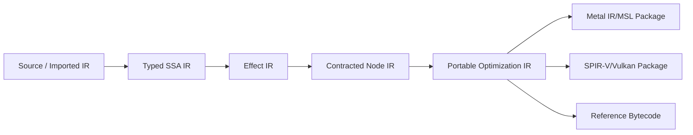

# 05 Compiler, Language, and IR

VG 的先进性不能只存在于 host API。如果 shader 仍围绕绑定槽、隐式 texture object 和固定 pipeline stage 编写，公共 ABI 的统一只会变成包装。本文件规定语言、schema、IR、effect 和后端 codegen 的最小架构。

## 1. 第一阶段语言策略

不从零发明完整 C++ 方言。采用分层输入：

1. **Canonical VG IR**：语义唯一来源，可序列化、验证和解释执行。
2. **VG Kernel C 子集**：接近 C/Slang 的研究前端，显式 address space、Region、facet 与 effect。
3. **Imported SPIR-V/Metal library**：仅作为受限互操作输入，必须补充/推导 contract；不能因导入而绕过验证。
4. **Generated host schema**：由同一类型系统产生 C/C++ layout header、reflection 和 capture schema。

未来可接 Slang/Clang/Rust 前端，但不让任一源语言成为核心语义。

## 2. 类型系统

核心类型包括：标量/向量/矩阵、定长数组、struct、enum、typed pointer、relative pointer、Region、FacetRef、NodeRef、local capability 和 atomic。类型必须带：

- address domain/address space；
- mutability 和 access；
- alignment/layout；
- provenance；
- nullable/optional；
- generation policy；
- host/device layout equivalence。

禁止：普通整数隐式转 pointer；跨 domain pointer compare/deref；未授权 pointer 扩权；把 facet capability 当地址；把 host opaque handle 放入 GPU schema。

## 3. 示例源模型

```c
struct Material {
    float4 base_color;
    facet<sample, rgba8> albedo;
};

struct SceneRoot {
    region<Vertex, linear, read> vertices;
    ptr<Material, device, read> materials;
    region<float4, attachment, write> color;
};

@node(domain = raster)
@effects(read(root.vertices), read(root.materials),
         sample(root.materials[*].albedo), write(root.color))
void draw_scene(ptr<SceneRoot, device, read> root, ExecutionShape shape);
```

`facet<sample>` 是访问能力而不是 texture 生命周期对象。编译器可将其 lowering 为 Metal texture argument、Vulkan descriptor index 或 reference software sampler。

## 4. Schema 是单一真相

每个可跨 host/device/capture 的类型生成：

- canonical schema ID（内容 hash + semantic version）；
- field offset/size/alignment；
- pointer/facet/capability relocation map；
- endianness 与 scalar encoding；
- C/C++ header；
- IR type declaration；
- reflection JSON；
- debug pretty-printer；
- capture migration hook。

构建必须比较 host compiler 的 `offsetof` 与 schema golden。禁止手写两套看似相同的 Task/Root struct。

## 5. IR 分层



### 5.1 Typed SSA IR

保留类型、地址域、provenance、bounds、facet kind、atomic ordering 和 source span。优化不能把有 provenance 差异的 pointer 任意合并。

### 5.2 Effect IR

将每个 memory/capability 操作归约为：

```text
Effect {
  operation: Read | Write | Atomic | Sample | Attachment | Publish | ...
  region_expression
  representation_requirement
  visibility_scope
  ordering
  conditionality
}
```

未知动态索引可扩大 effect，不能漏掉。调用图的 effect 逐层合并；递归/间接调用需要 effect bound。

### 5.3 Contracted Node IR

Node contract 包含允许的 root schema、execution domain、effect summary、facet set、subgroup assumptions、local memory、Task publication、child Node class、fault behavior 和 determinism flags。它是创建 `NodeRef` 前的验证合同。

## 6. ExecutionContract 推导

编译器按以下顺序：

1. 从 load/store/sample/atomic/publish 指令产生局部 effect；
2. 沿静态调用图传播；
3. 对间接调用使用 interface effect upper bound；
4. 用 Region shape/range analysis 缩小范围；
5. 将无法证明的 pointer traversal 标记为动态；
6. 生成 required AccessCertificate class；
7. 生成 backend representation requirements；
8. 将用户声明与推导结果比较，声明只能更保守；
9. 生成可供 runtime 验证的签名/hash。

`@effects` 不是相信用户的 escape hatch。checked profile 可插装验证声明是否覆盖实际访问。

## 7. AccessCertificate 推导

三个主要层级：

- **Static range**：base allocation + affine offsets + known bounds，可生成精确 ranges。
- **Bounded graph**：root 指向对象图，类型和 allocator metadata 限定可达 allocation set；生成 graph certificate。
- **Unknown dynamic**：数据相关指针、任意哈希/图遍历；要求 discovery、recoverable fault 或 Universe。

Discovery pass 必须读相同 topology epoch，并输出排序去重的 allocation/page set。它不是免费的：report 必须记录 pass 时间、扫描字节、页数、lease 时间与误差。

## 8. Pointer provenance 与优化规则

允许的优化：同 allocation/epoch 内 offset folding、bounds hoist、只读 pointer CSE、certificate-covered check elimination。禁止的优化：

- 将整数 hash 猜成 pointer；
- 越过 allocation/generation 的 pointer arithmetic；
- 把可能 stale 的 pointer 与新 generation 合并；
- 在 RepresentationEpoch 变化时复用 facet token；
- 跨 Publish release/acquire 移动内存访问；
- 假设 host coherent 即 GPU cache automatically visible。

## 9. 统一表示与 facet lowering

IR 的 Region 操作保持统一语义，但后端 intrinsic 可以不同：

| IR 操作 | Reference | Metal | Vulkan |
|---|---|---|---|
| `region.load` | checked byte load | device pointer/load | BDA/load |
| `region.sample` | software sampler | texture/sampler operation | image/sampler descriptor |
| `region.attachment.store` | software raster target | render attachment | dynamic rendering attachment |
| `region.atomic` | C++ atomic model | MSL atomic | SPIR-V atomic |
| `task.publish` | queue + release | buffer atomic/ICB path | buffer atomic/indirect path |

“没有特例”意味着共享 Region/lifetime/effect/version 法则，不意味着把硬件 texture sampler 退化成手写字节寻址。facet 是从统一逻辑表示到专用硬件单元的可验证投影。

## 10. 编译产物

`CodeObject` package 至少包含：

- canonical VG IR 与版本；
- schema table；
- Node contracts；
- CPU reference bytecode；
- 可选 Metal library/metallib 或 source；
- 可选 SPIR-V + pipeline metadata；
- specialization domain；
- debug/source map；
- capability requirements；
- compiler build/hash/signature。

Backend binary cache 不是 portable artifact，缓存键包含 GPU/OS/driver/compiler/options。

## 11. Baseline 与 specialization

每个 Node 应有 correctness baseline；后端 specialization 可基于稳定能力、format/layout、workgroup、constant 和 StateBlock。禁止把每个材质/小状态组合都制造成不可控 PSO permutation。

Specialization 必须报告：编译时间、cache key、cache hit、binary size、触发原因和 fallback。异步编译失败时只能使用事先声明的兼容 baseline，不能静默改变精度/effect。

## 12. GPU 生成 Task

编译器为 task producer 生成：slot bounds、payload schema、NodeRef class、release publication 和 quota checks。GPU 可选择授权 Node 并填 root/shape；不能创建新 CodeObject、Timeline、external ownership 或扩大 Envelope。

Task tiers：

| Tier | 能力 | 当前预期 |
|---|---|---|
| 0 | GPU 生成数据，CPU/下一提交消费 | 全后端 |
| 1 | GPU 生成同 Node indirect shape | Metal/Vulkan 可实验 |
| 2 | GPU 选择预授权 Node/状态桶 | backend/扩展相关 |
| 3 | GPU 自主扩展跨域执行图/OS 调度 | 当前不承诺 |

## 13. 内存模型

语言定义最小 portable memory model：workgroup、device、queue/system-visible scope；relaxed/acquire/release/acq_rel/seq_cst（后者可不高效）。Task publication、timeline signal 和 host mapping 有规定的 happens-before。Backend 必须拒绝无法表达的 scope，而不是弱化 ordering。

## 14. 诊断要求

诊断必须说 VG 概念：

```text
Node 17 writes Region scene.color at RepresentationEpoch 4,
but Envelope certificate covers read-only access at epoch 3.
Vulkan lowering would require a new attachment facet; submission rejected.
```

不得只转发“descriptor invalid”或 Metal validation 文本。backend 原始信息可以附加。

## 15. 编译器测试

- parser/type negative tests；
- schema layout golden；
- effect inference golden；
- pointer provenance verifier；
- IR round-trip/hash determinism；
- optimizer differential test（优化前后 reference 结果）；
- Metal/Vulkan codegen compile tests；
- backend capability rejection；
- Task publication litmus；
- randomized bounds/certificate instrumentation；
- old CodeObject/capture migration。

## 16. 第一阶段实现顺序

1. schema DSL + generated C header；
2. canonical IR data model/serializer/verifier；
3. CPU interpreter 与 effect trace；
4. minimal C-like frontend 或手写 IR fixtures；
5. SPIR-V compute codegen；
6. Metal compute codegen；
7. sample/raster facet；
8. Task publication 和 specialization；
9. discovery/witness instrumentation。

不要把完整语言前端放在 reference semantics 之前；否则语法工作会遮蔽真正需要验证的 contract。

