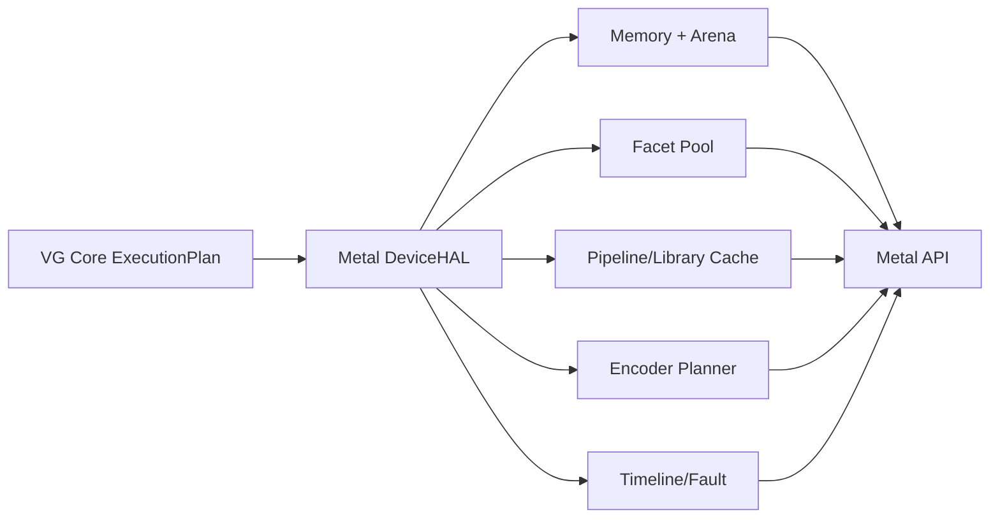

# 06 Backend: macOS / Apple M1 / Metal

本文件定义 M1 开发机上的 Metal DeviceHAL adapter。它是当前真实硬件执行路径，不是原生 VG UMD，也不能用于证明 Apple GPU 本身直接实现了 VG。

## 1. 支持边界

目标环境以运行时采集为准，不把某个 Metal SDK 文档中的最新能力误认为 M1 必然支持。每次运行记录：Mac 型号、Apple 芯片、统一内存大小、macOS build、Xcode/Metal compiler build、Metal language version、GPU family、feature sets 与所有相关 `supports*` 查询。

第一阶段必须支持：

- CPU/reference 与 Metal compute；
- shared/private memory allocation；
- typed root schema；
- 线性 Region load/store；
- SampleFacet/StorageFacet；
- render attachment 与基础 raster；
- command buffer/event timeline；
- GPU 写 Task/argument/indirect 数据；
- capture、counter sample（能力允许时）与 LoweringReport。

不承诺：绕过 Metal、可恢复 GPU page fault、任意 device-generated heterogeneous work graph、公开 Apple ISA、第三方 KMD 或所有 Metal 4 特性。

## 2. Adapter 结构

Objective-C++ 只存在于 backend target。`vg_core` 和公共头文件不得 import Metal/Foundation。adapter 对 core 暴露纯内部 C ABI/function table。

## 3. 能力探测

启动时生成 immutable capability snapshot，至少包括：

- supported GPU family 与 language version；
- max buffer length、buffer alignment、threadgroup memory/threads；
- argument buffer tier、resource indexing 相关限制；
- indirect command buffer support 与命令类型；
- dynamic libraries/function pointers（若有）；
- sparse texture/heap/placement 支持；
- counter sampling；
- shared event；
- raster order group、tile shader/imageblock（若有）；
- texture format usage、read/write/sample/filter/atomic 限制；
- ray tracing、mesh/object shader 等 domain 支持（若有）。

任何功能必须通过 selector availability + runtime query 双重守卫。缺失能力得到降低等级或 `Unsupported`，不能依赖 SDK 编译通过。

## 4. Memory 与 Arena

Apple Silicon 使用统一物理内存，但这不等于没有 storage mode、cache visibility、resource hazard 或 working set 压力。

建议策略：

| VG policy | Metal lowering | 用途 |
|---|---|---|
| host-visible coherent-ish | `MTLStorageModeShared` buffer | root/task/control/staging；仍遵守 command completion |
| device-preferred | `MTLStorageModePrivate` buffer/texture | 大型工作集和 attachment |
| transient placement | `MTLHeap`（能力/收益允许） | facet/temporary representation aliasing |
| reference/capture | shared + shadow metadata | 完整 witness/debug |

Arena 不能简单等于一个 `MTLBuffer`。它管理多 allocation、stable virtual/relative identity、backing policy、epoch 与 relocation。Metal 可用 `gpuAddress` 的设备和资源范围必须查询；当某路径不能可靠传递裸 GPU VA 时，adapter 使用 argument-buffer/facet index lowering，并明确报告。

## 5. Linear Region fast path

目标是 root data 中保存设备地址或可直接 lowering 的 pointer，MSL kernel 通过 typed `device T*` 访问。验证内容：

- 64 位地址稳定范围；
- alignment、bounds 与 allocation generation；
- shared/private backing 的可寻址性；
- shader 编译结果是否存在额外 argument lookup；
- pointer-chasing 对 cache/occupancy 的真实影响。

若 M1/选择的 Metal 语言路径不能表达某一地址形式，adapter 可将 root 降低为 argument buffer index，但类别至少是 `NATIVE_CACHED_OBJECT`，report 记录 indirection，不能宣称 direct VA。

## 6. Facet 与表示

### 6.1 SampleFacet

由 CanonicalView、RepresentationEpoch、pixel format、dimension、levels/slices、swizzle 和 sampler state 编译成 `MTLTexture`/`MTLSamplerState` 访问 token。可以缓存，但 key 必须包含 representation version 和 usage compatibility。

### 6.2 StorageFacet

映射为可读写 texture 或线性 buffer。格式不支持 write/atomic 时：允许显式转换表示、软件路径或 Unsupported；不得悄悄改 format/precision。

### 6.3 AttachmentFacet

映射为 render pass attachment。load/store/resolve 是 effect 和 representation 操作的 lowering，不成为公共对象状态机。tile-local 数据可在 adapter 内利用，但必须报告外存流量是否避免，且 portable semantics 不依赖 tile shader。

### 6.4 Facet pool

GPU 数据保存 index+generation，不保存 Objective-C object pointer。每个 slot 指向 backend resource/sampler/metadata；slot 只有在引用它的 RepresentationEpoch 退休后可复用。checked profile 在 shader 中验证 generation（可采样或仅 debug workload）。

## 7. Shader 与 Node

CodeObject Metal package 可包含 MSL source、air/metallib（依法和工具允许时）、reflection、function constants 与 contract。Node lowering 为 function/pipeline state + argument/facet layout + execution metadata。

Pipeline cache key 包含：CodeObject hash、entry、function constants、attachment formats/sample count、raster state 中 Metal 必须编译固定的部分、OS/GPU/compiler identity。小的动态状态不应无故扩大 key。

## 8. Task tiers

- **Tier 0**：GPU kernel 写 Task ring，后续 command buffer 或 host submit 消费。必须实现。
- **Tier 1**：same-Node indirect dispatch/draw；使用 indirect argument buffer/ICB，按运行时能力选择。目标实现。
- **Tier 2**：在预编码 ICB/pipeline 集内选择命令/Node。仅对能力支持的命令类型实验，并报告预编码、inherit state、reset 和 optimize 成本。
- **Tier 3**：GPU 任意创建跨执行域工作和扩 Envelope。M1 adapter 返回 Unsupported。

不得把 CPU 读取计数后重新编码命令标记为 GPU-driven native；它是 `HOST_ASSISTED`。

## 9. 同步 lowering

Core effect DAG 降低为：

- 同 encoder 中的自然顺序或必要 memory barrier；
- encoder boundary；
- command buffer dependency；
- `MTLSharedEvent` timeline（可用时）；
- host wait/signal；
- drawable/presentation ownership。

Adapter 负责区分 execution order 与 memory visibility。所有全局等待、额外 command buffer、encoder split 和 host wait 写入 report。禁止恢复一套公开 old/new resource usage API。

## 10. Residency 与 certificate

M1 统一内存会降低显式 residency 的可见程度，但不会消除 working set、page pressure 或 eviction。第一阶段：

| 模式 | Metal 行为 |
|---|---|
| `CertifiedPinned` | 验证范围，必要时声明/使用资源；记录工作集 |
| `DiscoverThenLease` | GPU discovery -> completion/event -> 后续执行；通常是额外 pass/submit |
| `FaultManaged` | 除非 Metal 明确提供所需可恢复语义，否则 Unsupported |
| `SoftwarePaged` | shader-visible page table/fallback；不伪装透明 fault |
| `Universe` | 包含 Arena 全体 backing；记录字节与压力 |

实验可用压力工作集、resident set、GPU time 和 page/VM counters 的可获得代理指标，但不能把缺少公开 counter 写成“没有迁移”。

## 11. RepresentationEpoch 与 destructive transform

默认保留旧 facet/backing 至相关 command buffer 完成。`ConsumeInput` 只有在 core 证明独占、无重放/外部引用、旧 epoch 完成后，才允许：reuse heap range、in-place compute transform 或立即释放旧 backing。adapter 不自行推断破坏性转换。

峰值内存报告包括 old/new backing、temporary、heap fragmentation 与 completion delay。若 Metal resource 表示无法原地转换，`ConsumeInput` 也只能减少保留时长，不能保证零额外内存。

## 12. Surface 与 present

窗口层通过 PlatformHAL 提供 `CAMetalLayer`/drawable bridge，公共 ABI 使用 external surface token。Acquire/present 是外部 ownership/timeline 操作。drawable texture 不能逃逸其授权 epoch；display format/color space/latency 进入 capture 元数据，但离屏 conformance 不依赖窗口。

## 13. Fault 与 device lost

捕获 command buffer error、encoder 状态、Node/Task stable ID、timeline point 和 backend diagnostic。出错 submission 的写集合标记 poisoned；只有合同明确的未触及/已完成区域可继续信任。不假设 command buffer 原子回滚。设备级错误进入单向 lost generation。

## 14. Metal 实验矩阵

| ID | 实验 | 关键 Metal 路径 | 必须报告 |
|---|---|---|---|
| M01 | linear pointer chain | buffer/device pointer | latency、indirection、assembly/IR evidence |
| M02 | root struct scaling | root/argument buffer | CPU encode、GPU time、bytes |
| M03 | sample facet | texture/sampler pool | facet cache、sample throughput |
| M04 | representation transform | buffer/texture/blit/compute | passes、bytes、peak memory |
| M05 | same-Node generated tasks | indirect/ICB | host submissions、GPU bubbles |
| M06 | heterogeneous authorized tasks | ICB if possible | tier/class/fallback |
| M07 | timeline/effect | encoders/shared event | barriers、splits、latency |
| M08 | certificate modes | discovery/shared memory | discovery cost、working set |
| M09 | ConsumeInput | heap/private resources | peak memory、replay loss |
| M10 | capture/replay | canonical capture | output hash、diagnostics |

## 15. 完成标准

Metal adapter 完成不是只画出三角形。必须通过 core conformance；支持 compute + raster/sample；产生 LoweringReport；对所有 Task/residency/fault 能力诚实分级；同一 workload 与 Vulkan 使用相同 canonical Task/Region/schema，仅 backend expectation 不同。
