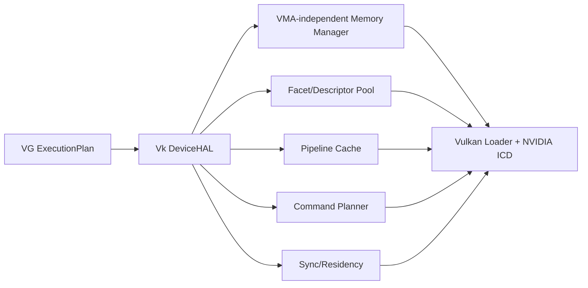

# 07 Backend: Linux / NVIDIA 50-series / Vulkan

本文件定义 NVIDIA 服务器上的 Vulkan DeviceHAL adapter。Vulkan 是现有厂商驱动的授权入口；本 adapter 用它验证 VG 的可降低性和开销，不把 Vulkan 概念提升为 VG 公共语义。

## 1. 环境前提与记录

推荐 Linux 发行版与驱动版本固定在实验 manifest 中。每次采集：kernel、distribution、CPU/NUMA、NVIDIA GPU 精确型号、VRAM、VBIOS（可得时）、driver、Vulkan loader、ICD、API version、扩展、feature/property chain、clock/power policy、display/headless 状态、MIG/virtualization 与后台负载。

NVIDIA “50 系”不能替代能力查询。所有 extension/feature 均运行时协商，文档不预设某个扩展必然存在。

## 2. 所需 Vulkan 基线

首选 Vulkan 1.3 或更高可用版本。最低实验能力：

- buffer device address；
- descriptor indexing/runtime arrays 或等价 descriptor buffer 路径；
- timeline semaphore；
- synchronization2；
- dynamic rendering（raster 实验）；
- indirect draw/dispatch；
- memory budget 查询；
- debug utils；
- timestamp queries。

可选研究能力：descriptor buffer、device generated commands、mesh shader、ray tracing、memory priority、calibrated timestamps、pipeline executable properties、host image copy、sparse binding。每项独立分级。

## 3. Adapter 结构

可以使用经过审查的辅助库，但 correctness 与 report 不能依赖不透明 allocator。初期自建小型 allocator 更便于记录 Arena/backing/alignment/budget；若引入 VMA，必须把其分配/迁移统计暴露出来。

## 4. Instance、Device 与 queue

Vulkan instance/device 只由 adapter 持有。Device capability snapshot 固定所有 enabled features；不为每 workload 重建 device。Queue family 选择以 compute/graphics/transfer/present 需求和 timestamp support 为依据。

VG Node 不是 `VkQueue`；ExecutionDomain 也不必一一对应 queue family。Adapter 可在同一 queue 串行、跨 queue 用 timeline 同步，或在 report 中因 ownership transfer/queue split 产生额外成本。

## 5. Memory 与 Arena

### 5.1 AddressFacet

线性 allocation 使用 `VkBuffer` + device address。地址只在 allocation lifetime/device address contract 内有效。必须启用所需 usage/allocation flags，并验证 alignment、address width 和 capture/replay address 能力。

Arena 可由大 buffer suballocation、dedicated allocation 或多 memory object 组成。选择依据：size、alignment、memory type、external/sparse、device address、mapping 与 representation。公开 Arena identity 不等于 `VkBuffer`。

### 5.2 Host visibility

区分 HOST_VISIBLE、HOST_COHERENT、HOST_CACHED 与 device local。非 coherent mapping 明确 flush/invalidate；host write 到 GPU read 的 happens-before 需要提交同步。NUMA/pinned staging 的 CPU 成本进入报告。

### 5.3 Budget/residency

利用 memory budget/priority 等可用能力观察和影响工作集，但 Vulkan core 不提供通用“任意指针访问时可恢复 page fault”合同。Sparse binding 是显式页映射，不等价于自动 fault recovery。

## 6. Facet/descriptor lowering

线性 `region.load/store` 优先用 BDA，不为每访问创建 descriptor。Sample/Storage/AttachmentFacet 需要 `VkImage`、view、sampler、layout/usage 与 descriptor token：

1. Core 固定 CanonicalView + RepresentationEpoch；
2. adapter 选择/创建 compatible image backing；
3. 创建 view/sampler；
4. 分配 descriptor index 或 descriptor-buffer offset；
5. 生成 index+generation capability；
6. epoch 退休后回收。

Descriptor indexing 是 facet table 的一种实现，不是公共 Bind Group。静态 Node 可缓存 descriptor；动态 facet 创建必须计数。若需要传统 descriptor set update，报告 update 次数/字节/CPU 时间。

## 7. Image layout 与 barrier

Vulkan 要求 image layout、stage/access mask 和 queue ownership。它们由 adapter 从 VG effect DAG + representation requirements lowering：

- VG 不向用户暴露 old/new layout；
- adapter 维护当前 backend representation state；
- 每个 barrier 都可以追溯到 effect edge、facet transform 或 external ownership；
- conservatively unknown 不得默默升级为全设备 barrier而不报告；
- layout transition 与 representation transform 在报告中分开。

Debug report 应输出 barrier count、scope、bytes/regions、原因、batching 与队列转移。

## 8. Shader/codegen

Canonical IR 降低为 SPIR-V，保留 physical/storage buffer addressing、non-uniform index、memory model 与 debug map。运行 `spirv-val`（目标环境有工具时）并让 Vulkan validation layer 参与 checked runs。

Node lowering 为 shader module + pipeline/layout metadata + specialization。Pipeline creation feedback/cache/executable statistics 能用则采集。不得把 driver pipeline cache 命中猜测成事实。

## 9. Raster lowering

使用 dynamic rendering 减少 render-pass 对象组合，但 attachment format/sample count、blend/depth/raster 中由 Vulkan pipeline 固定的部分仍参与 specialization。VG `StateBlock` 分为：

- shader-readable dynamic data；
- Vulkan dynamic state；
- pipeline-key state；
- unsupported/transform-required state。

分类必须由 capability 决定并进入 report。不要承诺“无 PSO”；目标是减少无语义必要的 permutation 并准确量化剩余部分。

## 10. Task lowering

### Tier 0

GPU 写 Task/indirect buffers，下一命令/提交读取。使用 storage buffer + atomic publication；buffer barriers由 effect edge产生。

### Tier 1

same-Node indirect dispatch/draw 使用 Vulkan indirect commands。数量由 count variant 或预分配上限表达（能力允许时）。记录 zero-fill、count read、barrier 和 max count。

### Tier 2

若设备支持合适的 device-generated commands，可在预授权 execution set 内让 GPU 选择 Node/pipeline。否则用分桶 compute pass + 每 Node indirect batch；此时是 `EMULATED_DEVICE_PASS`，需记录 bucket pass、scan/sort、temporary bytes 和 command count。

### Tier 3

GPU 向 OS 请求扩大 Envelope、创建任意 pipeline/timeline 或跨安全域执行不在当前 Vulkan adapter 合同内，返回 Unsupported。

## 11. Timeline 与同步

VG Timeline 优先映射 timeline semaphore。单调 value、wait-before-signal 合法性与跨 queue scope由 core验证。Host wait 使用 Vulkan wait API；presentation 使用 binary semaphore/WSI 所需桥接并记录。

Effect DAG lowering 优先 synchronization2。Adapter 合并兼容 barrier，但不能删除 representation/external ownership edge。Timestamp query 不应改变核心顺序；实验预热后批量 query。

## 12. Certificate 模式

| 模式 | Vulkan/NVIDIA lowering |
|---|---|
| `CertifiedPinned` | 确认相关 allocations 已 backing；budget/priority hint；提交 |
| `DiscoverThenLease` | compute discovery -> readback或GPU-side compact set -> host/queue binding决策 -> execute；按实际路径分级 |
| `FaultManaged` | 没有明确可恢复 fault contract 时 Unsupported |
| `SoftwarePaged` | shader-visible indirection/fallback；额外访问必须报告 |
| `Universe` | 整个 Arena 计入 working set；可能超 budget，提前失败或受控运行 |

标准 Vulkan adapter 很难在完全不回到 host 的情况下根据任意 GPU 生成页集合执行 OS residency 变更。因此 discovery 可能是 HostAssisted，这是重要实验结论，不应隐藏。

## 13. Sparse 与表示转换

Sparse image/buffer 支持时可实验页级 backing，但要求 queue sparse binding、tile granularity、metadata aspect 和 timeline 编排。它是显式 map/unmap，不是普通 pointer 的统一自动缺页。

Linear<->optimal image、format conversion、compression-compatible copy 使用 transfer/compute/render pass。每次转换绑定 RepresentationEpoch，记录源/目标字节、temporary、barrier 和 latency。

## 14. ConsumeInput

Core 确认 exclusive consume 后，adapter 可 alias memory、复用 scratch 或提前 retire descriptor/image。Vulkan aliasing 本身仍受 memory/image creation、layout 和 synchronization 规则约束。`ConsumeInput` 是允许优化，不保证 driver 能 in-place。

## 15. Presentation 与 headless

服务器首要 benchmark 使用 headless/offscreen，避免 WSI 噪声。展示实验通过 PlatformHAL surface 接入 swapchain；acquire/present 是 external ownership。结果明确区分 GPU rendering、queue present 与显示节拍。

## 16. Validation、fault 与 profiling

开发 run 启用 validation/debug utils；性能正式采样需分别运行 validation-off，且先用 validation-on 确认同一配置合法。捕获 `VkResult`、device fault 扩展信息（若有）、debug labels、Node/Task stable ID。

Profiling 至少包含 CPU encode/submit、GPU timestamp、pipeline compile、descriptor updates、barrier、allocation/budget、copy/transform bytes、host wait。可用 Nsight 工具进行二级分析，但机器可复现的 JSON 是主产物。

## 17. Vulkan 实验矩阵

| ID | 实验 | Vulkan 路径 | 必须报告 |
|---|---|---|---|
| V01 | BDA pointer chain | physical/storage address | latency、loads、cache proxies |
| V02 | root vs descriptor baseline | BDA/indexed descriptor | CPU/GPU/indirection |
| V03 | sample facet pool | descriptor indexing/buffer | allocation/update/cache |
| V04 | attachment representation | dynamic rendering | transitions、bandwidth |
| V05 | same-Node tasks | indirect/count | CPU submits、GPU bubbles |
| V06 | heterogeneous tasks | DGC or bucket pass | lowering class + extra work |
| V07 | effect DAG | sync2 | barrier scope/count/reasons |
| V08 | certificate modes | discovery/budget | pass/readback/working set |
| V09 | sparse mapping | sparse optional | granularity、bind cost |
| V10 | pipeline specialization | pipeline/cache | compile/cache/permutations |
| V11 | ConsumeInput | alias/retire | peak memory、latency |
| V12 | capture/replay | canonical + SPIR-V | hash/diagnostic consistency |

## 18. 完成标准

Adapter 必须：运行共享 conformance；至少 compute、sample/raster、BDA、timeline 和 Tier1；产生可审计 LoweringReport；明确拒绝 recoverable fault/Tier3 等缺失语义；所有对手 baseline 使用同一 Vulkan device、workload、shader算法和同步正确性。
