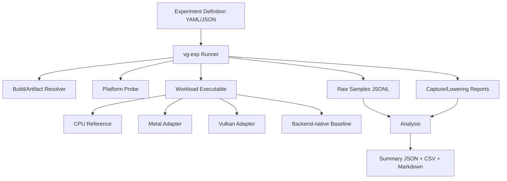

# 08 Experiment System

实验系统是项目产品的一部分。任何架构主张若不能由可重复实验或语义测试支撑，只能保留为 hypothesis。本文件规定 runner、数据、环境、执行和归档协议。

## 1. 目标

- 同一 canonical workload 在 CPU reference、Metal、Vulkan 与 native baseline 上运行；
- 同时测 correctness、CPU overhead、GPU work、memory/residency 和 lowering cost；
- 自动保存足以复现的代码、配置、环境和原始样本；
- 区分 compile/warmup/steady-state、host/device、native/emulated；
- 允许负面结果，不通过筛选样本美化结论。

## 2. 系统组成



Runner 不通过 GUI 驱动，不依赖人工复制结果。Nsight/Xcode GPU Capture 可作为补充证据，但主结果必须命令行可生成。

## 3. 实验定义

建议 canonical YAML：

```yaml
schema: vg.experiment/v1
id: E007
name: linear-root-versus-descriptor
workload: pointer_chain
backends: [cpu-reference, metal, vulkan]
variants:
  - vg_root_pointer
  - backend_native_descriptor
  - backend_native_bda
parameters:
  elements: [65536, 1048576]
  chain_depth: [1, 4, 16, 64]
  locality: [linear, shuffled]
protocol:
  cold_runs: 3
  warmup_iterations: 50
  measured_iterations: 200
  batches: 10
metrics: [cpu_encode_ns, cpu_submit_ns, gpu_ns, bytes_read]
correctness:
  oracle: cpu-reference
  tolerance: exact
requirements:
  vg_root_pointer: [typed_address]
  backend_native_bda: [buffer_device_address]
```

定义文件不写机器特定绝对路径。无法满足 requirement 的 variant 标记 `SKIPPED_UNSUPPORTED`，不是失败，也不能从汇总中冒充零成本。

## 4. 运行目录与不可变产物

一次 run ID：`<UTC>-<experiment>-<git-short>-<machine-id>-<nonce>`。目录：

```text
artifacts/runs/<run-id>/
  manifest.json
  environment.json
  build.json
  definition.resolved.json
  stdout.log
  stderr.log
  samples.jsonl
  summary.json
  summary.csv
  report.md
  lowering/
  captures/
  traces/
  outputs/
```

`manifest.json` 包含每个文件的 hash。原始样本 append-only；analysis 可以重跑并产出新版本，不覆写原始数据。

## 5. Environment probe

公共字段：

- UTC/local time、timezone、hostname hash/machine ID；
- git commit、dirty diff hash、build profile、compiler/linker；
- OS/kernel、CPU、core count、RAM、NUMA；
- power source、thermal/power mode；
- GPU identity、memory、driver、API/SDK；
- capability snapshot 完整 JSON；
- validation/capture/profiling 开关；
- process affinity/priority（若设置）；
- background load probe；
- command line 与所有 VG 环境变量。

macOS 特有：hardware/OS build、Metal family/language/capabilities、低电量模式、内存压力。Linux 特有：driver/loader/ICD、GPU clock/power/temperature、persistence mode、CPU governor、容器与 display 状态。

敏感信息应哈希或删除；但删除字段在 manifest 记录为 redacted。

## 6. Runner 生命周期

1. 解析并 schema-validate 定义；
2. 解析 backend/capability，产出完整 variant matrix；
3. 捕获环境和 build identity；
4. 运行 correctness preflight；
5. 独立运行 cold samples；
6. warmup 直到固定次数且稳定性条件满足；
7. 按随机或平衡顺序运行 measured batches；
8. 每 batch 检查输出 hash、device fault、thermal/clock drift；
9. 写 raw sample + lowering report；
10. 统计分析；
11. 产生 verdict 和 limitations；
12. hash/封存 run。

发生错误时保留已收集样本和失败上下文。Runner 不自动删除 outlier；只标记，并同时报告包含/排除结果。

## 7. 样本 schema

每行 JSONL 是一个 iteration 或聚合 batch：

```json
{
  "schema": "vg.sample/v1",
  "run_id": "...",
  "experiment": "E007",
  "backend": "vulkan",
  "variant": "vg_root_pointer",
  "parameters": {"elements": 1048576, "chain_depth": 16},
  "phase": "measured",
  "batch": 3,
  "iteration": 27,
  "status": "ok",
  "metrics": {
    "cpu_build_ns": 1200,
    "cpu_encode_ns": 4300,
    "cpu_submit_ns": 8900,
    "gpu_ns": 174200,
    "peak_backing_bytes": 8388608
  },
  "output_hash": "sha256:...",
  "lowering_report": "lowering/0003-0027.json"
}
```

时间单位固定 ns，字节固定 byte；显示时再转换。缺失 metric 是 `null + reason`，不写 0。

## 8. 时间测量

- CPU 使用 monotonic high-resolution clock；
- GPU 使用 backend timestamp query，记录 period/valid bits；
- 跨 CPU/GPU 只能在 calibrated timestamps 可用且误差报告时比较绝对时间；
- 首次编译、allocation、encode、submit、wait 分开计时；
- steady-state GPU time 不包含无关 host sleep；
- end-to-end time 必须明确从哪个 API call 到哪个 completion；
- query resolve/readback 成本作为独立 metric。

M1 和 NVIDIA 结果不能仅因 GPU ns 更小就互比架构优劣；跨机器主结论看相对 baseline 和 lowering 行为。

## 9. Memory 与 working set

至少测量：应用请求字节、backend committed bytes、resident/budget proxy、temporary bytes、facet/descriptor bytes、pipeline/cache bytes、capture bytes、峰值与 steady state。无法得到物理 residency 时明确标为 proxy。

Representation 实验按时间采样：旧 epoch、临时、new epoch、退休后的水位。`ConsumeInput` 同时报告正常、失败注入和 capture/replay 模式。

## 10. LoweringReport schema

```json
{
  "schema": "vg.lowering/v1",
  "submission": 42,
  "features": [
    {"feature": "linear_address", "class": "native_direct"},
    {"feature": "task_tier2", "class": "emulated_device_pass"}
  ],
  "counts": {
    "backend_commands": 18,
    "passes": 3,
    "barriers": 4,
    "descriptor_writes": 0,
    "host_round_trips": 0,
    "pipeline_compiles": 0
  },
  "bytes": {"copied": 0, "temporary": 4194304},
  "warnings": []
}
```

每个计数定义必须稳定，新增字段只追加。性能数据必须能关联具体 report。

## 11. Correctness oracle

优先级：

1. exact CPU reference；
2. deterministic mathematical oracle；
3. backend-native baseline；
4. image/float tolerance 规则；
5. invariants/metamorphic relations。

容差在实验定义中预先固定：absolute、relative、ULP、image PSNR/SSIM 或 domain metric。不能看完结果再放宽。NaN、signed zero、denormal policy 明确。

## 12. 随机性与输入

每个随机输入记录 algorithm、seed、generator version 和 input hash。随机图应包含可调 degree、locality、cycle、reachable fraction。实验的所有 variants 使用完全相同输入或明确配对变换。

## 13. 跨机器执行

代码和定义相同，build 可机器本地完成；run bundle 回收到同一 `artifacts/runs` 结构。服务器执行不依赖从 Mac 共享绝对路径。建议 runner 提供：

```text
vg-exp probe
vg-exp build --backend vulkan
vg-exp run experiments/E007.yaml --variant all
vg-exp analyze artifacts/runs/<id>
vg-exp compare <run-a> <run-b>
```

远程调度不是第一阶段 requirement；可先 SSH 手动触发同一命令。Agent 不应把凭据写入仓库或 run bundle。

## 14. Reproducibility 等级

| 等级 | 条件 |
|---|---|
| R0 | 只有摘要，不可复现；不得支持架构结论 |
| R1 | 有代码/参数/环境/原始样本 |
| R2 | 同机重复，结论方向和置信区间一致 |
| R3 | 同型号不同时间/driver 或另一机器重复 |
| R4 | 独立实现/外部复现 |

第一阶段正式结论至少 R2；跨 backend 结论各 backend 均至少 R2。

## 15. 实验更改规则

定义、workload、metric 或 oracle 变化必须增加 experiment revision。Bug 修复可保持 ID，但记录 revision 和旧 run invalid reason。不能只重跑表现差的 variant；平衡随机化矩阵整体重跑。

## 16. 最小实现顺序

1. JSON schema + platform probe；
2. subprocess runner、raw JSONL、manifest/hash；
3. CPU clock/correctness/output hash；
4. backend timestamp + LoweringReport；
5. summary statistics/Markdown；
6. cross-run compare；
7. memory/residency probes；
8. optional trace/capture integration。

