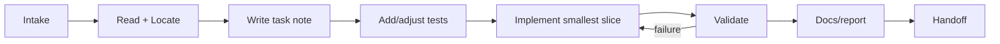

# 11 AI Agent Workflow

本文件是所有 AI Agent 的执行协议。目标不是限制实现速度，而是防止多个 Agent 在没有共同语义和证据标准时各自发明一个“VG”。

## 1. 接单后的强制读取

所有任务先读 [../START.md](../START.md)。随后：

| 任务 | 必读 |
|---|---|
| 语义/架构 | 01、02、03、12 |
| 公共 API | 01-04、13 |
| 编译器/IR | 02、03、05、10 |
| Metal | 02、03、05、06、08-10 |
| Vulkan | 02、03、05、07、08-10 |
| 实验/benchmark | 08、09、10 + 对应后端 |
| 工具/capture | 03、05、08、10、13 |

阅读后先写 task note：目标、涉及不变量、预计文件、验证、是否改变语义/ABI、backend 范围。

## 2. 权限边界

Agent 可以直接：实现已记录语义；增加内部测试/工具；修复 bug；增加不改变 ABI 的 backend lowering；补文档证据。

Agent 必须先更新规范/决策记录：新增公共对象或 effect；改变 lifetime/epoch；增加 ABI；把 Unsupported 改成 fallback；更改 capture schema；改变实验 oracle/threshold。

Agent 不得：绕过 Metal/Vulkan/KMD 安全边界；静默弱化 ordering/access；为了过测试屏蔽 validation；删除不利 benchmark；把 backend handle 暴露进 core/public ABI；用 CUDA 语义替代 core。

## 3. 标准任务流程



### 3.1 Intake

重述 observable outcome，不把“实现 bindless”之类技术手段当目标。列出 out-of-scope。

### 3.2 Locate

优先查询代码知识图和架构；确认现有 ownership 与用户未提交修改。不要先大规模重构。

### 3.3 Task note

位置建议 `artifacts/tasks/<task-id>.md`，内容：

```markdown
# TASK-012: Vulkan timeline lowering
Status: in-progress
Normative docs: 02 sections 7-8; 03 section 7; 07 section 11
Invariants: monotonic values; no hidden host wait
Files: ...
Tests: ...
Risks: queue ownership interaction
Decision needed: none
```

### 3.4 Tests first enough

不是所有代码必须严格 TDD，但修改前必须知道失败如何被观察。语义/ABI bug 先加最小 negative test；backend性能优化先保证 correctness test 和 metric 存在。

### 3.5 Implementation

保持垂直小切片。例如先完成 compute-only linear Region 的 end-to-end，不同时写 raster、ray、sparse。新抽象只有在移除真实重复或编码不变量时加入。

### 3.6 Validation

按风险运行：format/static -> unit -> relevant conformance -> backend smoke -> benchmark。不能运行服务器测试时说明，并提供精确远程命令和预期 artifact，不伪造通过。

### 3.7 Documentation

若行为、ABI、lowering class、capability 或实验变化，同次任务更新对应文档。注释解释“为什么此处需要 backend rule”，不复述代码。

### 3.8 Handoff

最终说明 outcome、关键文件、测试命令/结果、未运行项、lowering/性能数据、已知限制和下一个解锁步骤。

## 4. 变更类别

| 类别 | 要求 |
|---|---|
| `SEMANTIC` | 修改 02/ADR、model tests、所有 backend impact |
| `ABI` | 修改 04、version/layout golden、binding impact |
| `IR` | 修改 05、round-trip/verifier/codegen tests |
| `BACKEND` | capability + conformance + LoweringReport |
| `EXPERIMENT` | definition revision + oracle + raw schema |
| `TOOLING` | input/output schema、failure behavior |
| `DOC_ONLY` | link/check，不宣称代码行为变化 |

PR/提交标题可使用类别前缀，即使项目暂时不创建 PR。

## 5. Architecture Decision Record

不可逆或跨组件决策写 `docs/decisions/ADR-NNN-title.md`：Context、Decision、Alternatives、Consequences、Evidence、Revisit trigger。状态：Proposed/Accepted/Superseded/Rejected/Experimental。

以下必需 ADR：公共 handle 编码；canonical IR format；schema compatibility；Task publication protocol；backend plugin ABI；fault/poison；capture address relocation；dynamic certificate/discovery；facet pool；pipeline cache。

“我觉得更优雅”不是 evidence。Evidence 可是 invariant 简化、conformance、benchmark、平台约束或维护成本。

## 6. 语义改动清单

Agent 必须回答：

1. 新概念能否由 Region/Effect/Epoch/Envelope 表达？
2. 它属于数据平面还是 authority 控制平面？
3. CPU/GPU 是否都能生成；若不能，为什么？
4. 生命周期、publication、retirement 是什么？
5. fault 后哪些输出可信？
6. Metal/Vulkan 能否 native lowering？
7. lowering 不可行时是 Unsupported、device pass、host assisted 还是 reference？
8. 如何测试和量化？

无法回答时保持 Experimental，不进入 public ABI。

## 7. Backend 改动清单

- runtime capability query，而非型号猜测；
- core header 不引 backend header；
- direct/cached/device-pass/host-assisted/serialized/unsupported 分类；
- 统计 object/pass/barrier/copy/host wait；
- debug validation 通过；
- adapter conformance 增量；
- native idiomatic baseline；
- device-lost/cleanup path；
- feature absent 的测试。

## 8. Experiment 改动清单

- hypothesis 可证伪；
- variables/control/oracle 固定；
- baseline 公平；
- seed/input hash；
- cold/warm 分离；
- raw samples；
- environment/capability；
- statistical rule；
- negative/unsupported 保留；
- artifact manifest。

## 9. 多 Agent 协作

按 ownership 拆分独立工作：core semantics、compiler、Metal、Vulkan、experiment infra。公共 schema/header/DeviceHAL 是高冲突区域，只允许一个 task owner 修改；其他 Agent 通过设计 note 提议。

交接必须说明工作树状态和未提交/生成文件。不要回滚不属于自己的修改，不用大范围格式化制造冲突。

## 10. 代码审查优先级

1. lifetime/authority/memory safety；
2. 语义与 memory model；
3. backend capability 诚实性；
4. fault/cleanup；
5. ABI/serialization compatibility；
6. correctness tests；
7. hidden cost/reporting；
8. performance；
9. readability/style。

审查发现性能更快但语义更弱时必须拒绝。

## 11. 完成定义模板

```markdown
## Definition of Done
- [ ] Normative docs unchanged or updated
- [ ] Public/IR schema version handled
- [ ] Unit + negative tests pass
- [ ] CPU conformance passes
- [ ] Relevant Metal/Vulkan tests pass or are explicitly unrun
- [ ] LoweringReport covers new path
- [ ] Experiment/baseline exists for performance claim
- [ ] No hidden host wait/global sync
- [ ] Task note contains result and remaining risks
```

## 12. Agent 不应自行扩大的范围

- 完整 shader IDE/language server；
- 游戏引擎集成；
- Windows/D3D12；
- browser sandbox；
- ray tracing/tensor/video 全功能；
- open KMD/firmware；
- distributed build/benchmark service。

除非当前 phase 明确进入这些目标，先记录 backlog。

