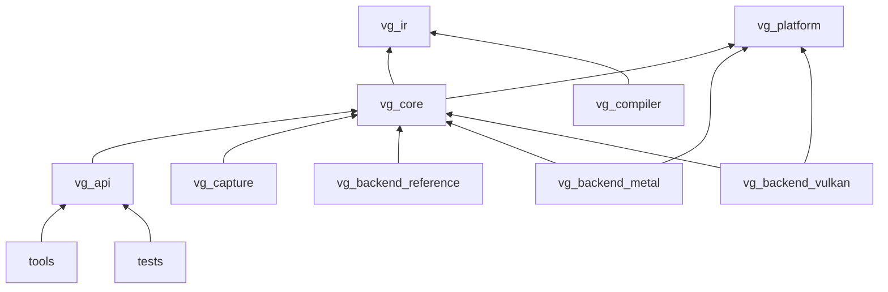

# 13 Repository Layout and Build Plan

本文件规定初始仓库骨架、模块 ownership、生成物和构建入口。Agent 应在需要时逐步创建，不要在第一天生成大量空模块。

## 1. 建议目录

```text
/
  CMakeLists.txt
  CMakePresets.json
  LICENSE
  README.md                    -> points to docs/START.md
  cmake/
  include/
    vg/
      vg.h                     public C ABI only
      vg_platform.h            optional surface/external interop
      vg_version.h
  src/
    api/                       C entry/function table/handle dispatch
    core/                      semantics, lifetime, task/effect/envelope
    ir/                        canonical IR/schema/serialization/verifier
    compiler/                  frontend and backend package orchestration
    platform/                  dylib/thread/clock/file/surface abstractions
    capture/                   canonical capture/replay
    backends/
      device_hal.h             internal versioned plugin ABI
      reference/
      metal/
      vulkan/
  tools/
    vg-schema/
    vg-compile/
    vg-inspect/
    vg-replay/
    vg-exp/
  tests/
    abi/
    unit/
    model/
    conformance/
    differential/
    fuzz/
    fixtures/
  experiments/
    definitions/
    workloads/
    baselines/
    analysis/
  schemas/
    api/
    ir/
    capture/
    experiment/
  docs/
    START.md
    vg-project/
    decisions/
    reports/
  examples/
    00-enumerate/
    01-linear-compute/
    02-pointer-graph/
    03-generated-tasks/
    04-sample-raster/
  generated/                  build-generated; never hand edit
  artifacts/                  ignored raw runs except curated manifests
    tasks/
    runs/
  third_party/
```

## 2. Target dependency graph



图表示“上层依赖下层”的逻辑；backend 仅依赖内部 plan/IR headers，不反向进入 core。Metal/Vulkan SDK 链接只出现在对应 target。

## 3. Ownership

| 路径 | 职责 | 禁止 |
|---|---|---|
| `include/vg` | 稳定 ABI | backend/private C++ 类型 |
| `src/api` | 参数/handle/dispatch | 语义重复实现 |
| `src/core` | 唯一语义状态机 | Metal/Vulkan include |
| `src/ir` | schema/IR truth | OS/GPU allocation |
| `src/backends/*` | lowering | 修改 canonical meaning |
| `schemas` | versioned wire formats | generated output |
| `generated` | build result | 手工 patch |
| `experiments` | workload/baseline/analysis | 正式 run 原始数据进 git |
| `artifacts` | local/run evidence | secret/credential |

## 4. Build profiles

- `dev-reference`：Debug/ASan/UBSan，CPU/reference，完整 validation；
- `dev-metal`：macOS arm64，reference+Metal，validation；
- `perf-metal`：优化、无 sanitizer、report/timestamp 保留；
- `dev-vulkan`：Linux，reference+Vulkan，validation layers；
- `perf-vulkan`：优化、validation off、report/timestamps；
- `fuzz`：parser/ABI/model fuzz；
- `docs`：links/schema/code fence checks。

Preset 固定选项但不硬编码 SDK 私有路径。依赖发现失败给可操作错误。

## 5. 最小外部依赖

Phase 0 尽量少：

- CMake + Ninja；
- C++20 内部实现，公共 C11；
- 平台 SDK（Xcode/Metal；Vulkan headers/loader）；
- 轻量 test framework 或自建明确 harness；
- JSON parser/schema validator；
- optional SPIR-V tools；
- Python 3 只用于实验分析/生成，不作为 runtime 依赖。

每个依赖记录版本、license、用途和是否 vendored。禁止为了简单 allocator/logger 引入巨型引擎。

## 6. Generated code

Schema compiler 输出到 build tree 或 `generated/`：C layout header、IR definitions、reflection、hash、serializer、golden manifest。每个生成文件首部包含 generator version/source hash，并写“do not edit”。CI 运行 regenerate-and-diff。

## 7. DeviceHAL plugin ABI

内部 `device_hal.h` 也版本化：

```c
typedef struct VgHalApi {
    uint32_t abi_version;
    uint32_t size;
    VgResult (*probe)(const VgHalProbeDesc*, VgHalProbeResult*);
    VgResult (*create_device)(const VgHalDeviceDesc*, VgHalDevice*);
    VgResult (*compile_plan)(VgHalDevice, const VgExecutionPlan*,
                             VgHalCompiledPlan*, VgLoweringReport*);
    VgResult (*submit)(VgHalDevice, VgHalCompiledPlan,
                       const VgHalSubmitDesc*, VgHalSubmission*);
    void (*destroy_device)(VgHalDevice);
} VgHalApi;
```

实际接口还需 allocation、mapping、timeline、code、facet、fault。`ExecutionPlan` 不直接暴露 C++ object graph，优先使用 immutable views/versioned structs。Plugin 只在兼容 minor ABI 加载。

## 8. Test layout

Conformance test 是数据驱动：测试定义 + canonical IR/schema + expected result/error。Backend harness 只负责选择 device。避免复制三套 test source。

Golden 文件必须可审查；更新 golden 的命令与 diff 在任务说明中。Fuzz corpus 可提交最小输入，不提交无限生成 artifact。

## 9. Experiment workloads 与 baselines

每个 workload 提供：canonical input generator、CPU oracle、VG implementation、Metal native baseline、Vulkan native baseline（适用时）、definition、metric declaration、README。共享算法代码可生成，但不能让 baseline 偷用 VG runtime 从而掩盖其 CPU overhead。

## 10. Artifact/version policy

- source/docs/definitions/curated small reports：git；
- build tree、shader cache、raw large captures/runs：ignore/content store；
- 正式论文/里程碑 run：保存 manifest、summary 和外部 immutable archive link/hash；
- capture/IR/schema 都有独立版本；
- 不提交 machine credential、用户名路径或未脱敏 hostname。

## 11. CI 建议

每个提交：format、compile、ABI/layout、unit、IR verifier、CPU conformance、docs links。M1 self-hosted 可跑 Metal smoke；NVIDIA server 可按批次跑 Vulkan conformance。正式性能不在共享噪声 CI 判定，只运行 smoke 和定期受控 benchmark。

## 12. 初始提交切片

1. docs + CMake presets + empty public header version；
2. result/runtime/allocator/logger + unit；
3. backend loader + reference probe；
4. platform probe + experiment bundle；
5. schema generator + Task/root golden；
6. Arena/epoch reference；
7. ExecutionPlan/DeviceHAL；
8. Metal compute slice；
9. Vulkan compute slice。

每片都应 build/test；不一次提交所有空目录和虚假接口。

## 13. 根 README 最小内容

根 README 只需说明项目研究目标、支持平台、构建最短路径，并醒目链接 [../START.md](../START.md)（实际从仓库根使用 `docs/START.md`）。架构细节只维护在本组，避免多处漂移。

